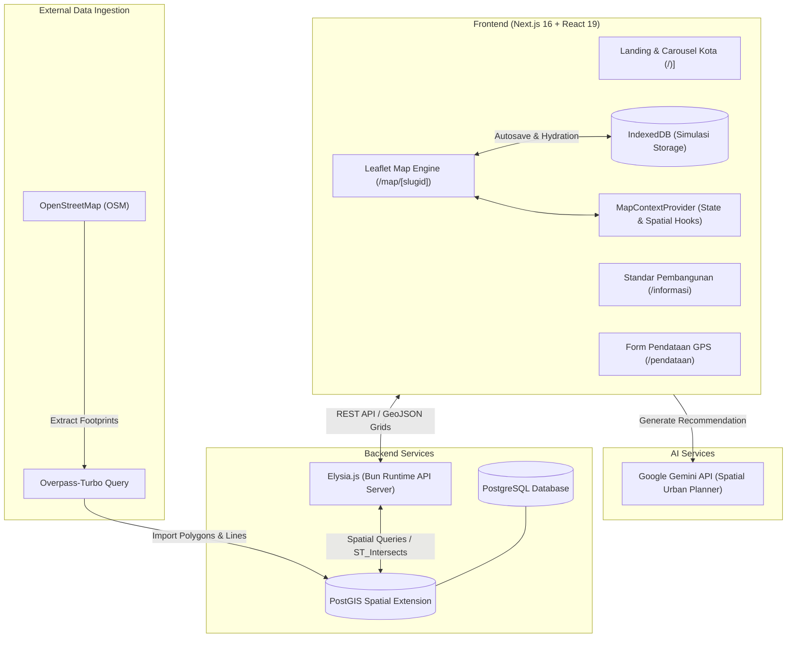

# 🏙️ CitySim — Spatial City Planning Simulation & Housing Information System

**CitySim** adalah platform visualisasi spasial, analisis kelayakan hunian, dan simulasi perancangan tata kota interaktif berbasis web. Aplikasi ini dirancang untuk memetakan kondisi perumahan (termasuk Rumah Tidak Layak Huni / RTLH), merancang intervensi fisik perkotaan secara presisi, memvalidasi standar teknis tata ruang, serta memanfaatkan Artificial Intelligence (AI) sebagai asisten perencana kota (*AI Urban Planner*).

---

## 📑 Daftar Isi

- [Fitur Utama](#-fitur-utama)
  - [1. Simulasi Perancangan Kota Interaktif](#1-simulasi-perancangan-kota-interaktif)
  - [2. Sistem Standar Pembangunan & Validasi Spasial](#2-sistem-standar-pembangunan--validasi-spasial)
  - [3. Rekomendasi Pembangunan Berbasis AI](#3-rekomendasi-pembangunan-berbasis-ai)
  - [4. Pendataan Titik Rumah & Survei Lapangan (/pendataan)](#4-pendataan-titik-rumah--survei-lapangan-pendataan)
  - [5. Standar & Regulasi Pembangunan (/informasi)](#5-standar--regulasi-pembangunan-informasi)
- [Arsitektur Sistem](#-arsitektur-sistem)
  - [Diagram Arsitektur](#diagram-arsitektur)
  - [Komponen Utama](#komponen-utama)
- [Tech Stack](#-tech-stack)
- [Struktur Direktori](#-struktur-direktori)
- [Panduan Instalasi & Menjalankan Aplikasi](#-panduan-instalasi--menjalankan-aplikasi)
  - [Prasyarat](#prasyarat)
  - [Variabel Lingkungan (.env)](#variabel-lingkungan-env)
  - [Langkah Instalasi](#langkah-instalasi)

---

## 🚀 Fitur Utama

### 1. Simulasi Perancangan Kota Interaktif
Fitur utama yang memungkinkan pengguna merencanakan dan memodifikasi tata ruang kota dengan kalkulasi dampak indikator secara langsung (*real-time*):
- **Mode Renovasi**: Meningkatkan status rumah dari tidak layak huni (*unfit*) menjadi layak huni dengan menghubungkan fasilitas air bersih dan pembuangan air limbah/drainase.
- **Mode Relokasi**: Memindahkan rumah penduduk ke koordinat target baru dengan translasi verteks poligon dan pengecekan kelayakan lokasi tujuan.
- **Mode Pembangunan**: Menggambar poligon tapak bangunan baru (hunian, fasilitas umum, kuliner, RTH, infrastruktur) atau jaringan pipa bawah tanah (drainase, IPAL, air bersih) dengan kalkulasi luas otomatis menggunakan *Shoelace formula*.
- **Mode Rekonstruksi**: Membangun ulang bangunan eksisting menjadi bangunan bertingkat yang memenuhi standar koefisien lantai bangunan.
- **Kalkulasi Indikator Perkotaan Real-Time**:
  - Persentase Rumah Tidak Layak Huni (RTLH)
  - Koefisien Dasar Bangunan (KDB / Building Coverage Ratio)
  - Koefisien Lantai Bangunan (KLB / Floor Area Ratio)
  - Rasio Ruang Terbuka Hijau (RTH)
  - Ketercukupan Jaringan Drainase & Air Limbah
  - Cakupan Akses Air Bersih (PDAM) & Titik Hydrant Damkar
  - Jumlah dan Kepadatan Penduduk (jiwa/km²)
- **Penyimpanan Lokal Persisten (IndexedDB)**: Progress simulasi tersimpan secara otomatis (*auto-save* dengan debounce) di peramban pengguna per masing-masing kota tanpa membebani bandwidth.

### 2. Sistem Standar Pembangunan & Validasi Spasial
Menegakkan aturan baku tata ruang perkotaan agar pembangunan baru maupun relokasi tidak melanggar regulasi:
- **Garis Sempadan Sungai (GSS)**: Validasi jarak batas terluar poligon bangunan terhadap garis bibir sungai minimal $\ge 3\text{ meter}$.
- **Zona Penyangga TPA (Tempat Pembuangan Akhir)**: Larangan penempatan hunian dalam radius $< 150\text{ meter}$ dari area TPA sampah guna menjamin kesehatan dan sanitasi lingkungan.
- **Pencegahan Tumpang-Tindih (*Overlap Prevention*)**: Algoritma deteksi persilangan garis (*line segment intersection*) dan titik di dalam poligon (*Ray-Casting*) untuk memastikan bangunan baru tidak menimpa bangunan lain.
- **Pembatasan Batas Administratif (*Flexible Boundaries Lock*)**: Peta Leaflet secara dinamis mengunci viewport kamera (`maxBounds` dan `maxBoundsViscosity=1.0`) sesuai batas resmi kota yang dipilih (Madiun, Kediri, Mojokerto, Pasuruan) sehingga pengguna tidak dapat menggeser peta keluar batas wilayah.

### 3. Rekomendasi Pembangunan Berbasis AI
Didukung oleh **Google Gemini API** (`@google/genai`) yang berperan sebagai *Ahli Perencana Kota dan Analis Spasial*:
- Mengevaluasi distribusi spasial bangunan eksisting, titik-titik RTLH, jalur drainase, serta aliran sungai.
- Menentukan titik koordinat rekomendasi intervensi pembangunan prioritas (misalnya penambahan IPAL, RTH, atau saluran drainase sekunder).
- Menyajikan **3 poin alasan pertimbangan ilmiah/regulasi** dan ringkasan estimasi dampak positif bagi kota.
- Tombol **"Tuju Titik Ini di Peta"** (*FlyTo*) yang langsung mengarahkan kamera peta ke titik koordinat rekomendasi AI.

### 4. Pendataan Titik Rumah & Survei Lapangan (`/pendataan`)
Portal survei partisipatif untuk pembaruan data kondisi rumah warga secara berkesinambungan:
- **Geolokasi GPS Presisi**: Mengambil koordinat lintang dan bujur secara otomatis menggunakan Browser Geolocation API.
- **Identitas Pemilik & Fisik Bangunan**: Pendataan Nama Pemilik, NIK, Alamat lengkap, dan deskripsi kondisi fisik bangunan.
- **Dokumentasi Visual**: Pengunggahan foto fisik rumah (format JPG, JPEG, PNG hingga 5MB) dengan pratinjau langsung.
- **Integrasi Laporan**: Data diteruskan ke backend API untuk diverifikasi dan dimasukkan ke dalam basis data spasial kota.

### 5. Standar & Regulasi Pembangunan (`/informasi`)
Halaman referensi terpusat mengenai panduan teknis dan regulasi perumahan:
- **Persyaratan Perencanaan**: Ketentuan tata bangunan, keselamatan struktur, pencegahan bahaya kebakaran, serta pedoman tata ruang wilayah.
- **Standar Luas Lantai & Ruang**: Kebutuhan ruang minimum per jiwa ($7{,}2 - 10\text{ m}^2/\text{jiwa}$) untuk memastikan kenyamanan dan kesehatan penghuni.
- **Prasarana & Utilitas Utama**: Pedoman sistem penyediaan air bersih, pembuangan air limbah, dan ketercukupan jaringan drainase lingkungan.

---

## 🏗️ Arsitektur Sistem

### Diagram Arsitektur



### Komponen Utama

1. **Frontend (Next.js 16 & React 19)**:
   - Menggunakan App Router dengan arsitektur Server Components dan Client Components.
   - **React-Leaflet** dengan akselerasi grafis HTML5 Canvas (`preferCanvas={true}`) untuk merender ribuan poligon tapak bangunan tanpa lag.
   - **Tailwind CSS v4** untuk antarmuka pengguna yang bersih, responsif, dan ergonomis.
   - **Spatial Utilities Engine** lokal di sisi peramban (`lib/spatial-utils.ts`) untuk kalkulasi geometri cepat: *Haversine distance*, *Shoelace polygon area*, *Ray-Casting point-in-polygon*, dan *segment intersection*.

2. **Backend (Elysia.js & Bun)**:
   - Dibangun menggunakan framework **Elysia.js** di atas runtime **Bun** yang menghasilkan performa I/O tinggi, latensi rendah, dan type-safety menyeluruh.
   - Menyediakan REST API untuk master data kota, data grid spasial, data bangunan per-grid, jaringan drainase bawah tanah, dan penampungan laporan survei.

3. **Spatial Database (PostgreSQL + PostGIS)**:
   - Data spasial disimpan dalam format geometri PostGIS (`GEOMETRY(Polygon, 4326)` dan `GEOMETRY(LineString, 4326)`).
   - Memanfaatkan *Spatial Indexing* (GiST / R-Tree) untuk pemotongan data per grid wilayah kota (`grids/by-city/:slugid`), meminimalkan beban transfer memori ke client.

4. **Data Acquisition Pipeline (OSM Overpass-Turbo)**:
   - Data batas kota, poligon tapak bangunan (*building footprints*), kontur sungai, dan jaringan jalan diekstraksi dari **OpenStreetMap** melalui query **Overpass-Turbo**.
   - Data GeoJSON hasil ekstraksi dinormalisasi dan diimpor ke basis data PostGIS.

5. **AI Inference Layer**:
   - Next.js Route Handler (`/api/ai-recommendation`) berkomunikasi dengan **Gemini API** menggunakan SDK `@google/genai`.
   - Prompt rekayasa spasial menyertakan ringkasan indikator kota, centroid bangunan, sebaran saluran air limbah, dan sempadan sungai untuk menghasilkan rekomendasi terstruktur.

---

## 💻 Tech Stack

| Kategori | Teknologi | Deskripsi |
| :--- | :--- | :--- |
| **Framework Frontend** | [Next.js 16 (Turbopack)](https://nextjs.org/) | React Framework dengan App Router |
| **Library UI** | [React 19](https://react.dev/), [Tailwind CSS v4](https://tailwindcss.com/) | Desain antarmuka modular & styling performan |
| **Pemetaan Spasial** | [Leaflet](https://leafletjs.com/), [React-Leaflet](https://react-leaflet.js.org/) | Peta interaktif dengan layer kanvas |
| **Komponen UI** | [Lucide React](https://lucide.dev/), [Base UI](https://base-ui.com/) | Set icon modern & komponen aksesibel |
| **Artificial Intelligence** | [Google Gemini API (@google/genai)](https://ai.google.dev/) | Model LLM untuk analisis spasial perkotaan |
| **Runtime & Package Manager** | [Bun](https://bun.sh/) | Runtime JS/TS berkecepatan tinggi |
| **Backend Framework** | [Elysia.js](https://elysiajs.com/) | Framework backend performa tinggi berbasis Bun |
| **Database** | [PostgreSQL](https://www.postgresql.org/) + [PostGIS](https://postgis.net/) | Manajemen basis data relasional & analisis spasial |
| **Sumber Data Spasial** | [OpenStreetMap](https://www.openstreetmap.org/) (Overpass-Turbo) | Ekstraksi tapak bangunan & geodatas |

---

## 📁 Struktur Direktori

```text
city-sim/
├── app/                              # Next.js App Router
│   ├── api/
│   │   └── ai-recommendation/        # Route handler rekomendasi AI (Gemini)
│   ├── informasi/                    # Halaman standar pembangunan & regulasi
│   ├── map/
│   │   └── [slugid]/                 # Halaman interaktif simulasi peta per kota
│   │       ├── actions.ts            # Server actions pemanggilan API backend
│   │       └── page.tsx              # Dynamic route handler peta kota
│   ├── pendataan/                    # Halaman formulir survei GPS titik rumah
│   ├── reports/                      # Proxy route untuk pengiriman laporan survei
│   ├── globals.css                   # Konfigurasi Tailwind & gaya global
│   ├── layout.tsx                    # Root layout
│   └── page.tsx                      # Landing page (Home)
├── components/                       # Komponen UI bersama
│   ├── ui/                           # Button, Card, Dialog, Input, Separator, dll.
│   ├── carousel.tsx                  # Komponen carousel kota di beranda
│   ├── grid-building.tsx             # Renderer poligon bangunan di canvas Leaflet
│   └── layer-panel.tsx               # Panel kontrol layer & filter tipe bangunan
├── constants/
│   └── helper.ts                     # Konfigurasi koordinat kota, tipe bangunan, rumus
├── hooks/
│   └── useMapContext.tsx             # Context & state simulasi (bangunan, layer, relokasi)
├── lib/
│   ├── spatial-utils.ts              # Algoritma kalkulasi spasial & validasi sempadan
│   ├── storage/
│   │   └── simulation-db.ts          # Driver IndexedDB untuk autosave simulasi
│   └── utils.ts                      # Helper format density, parsing GeoJSON, cn()
├── modules/                          # Modul tampilan fitur
│   ├── home/                         # Komponen beranda & pencarian kota
│   ├── informasi/                    # Modul konten standar perencanaan & utilitas
│   ├── map/                          # Modul sidebar simulasi, rekomendasi AI, leaflet
│   └── pendataan/                    # Modul form input survei & tombol kembali
├── public/                           # Aset gambar, ikon SVG, & visual
├── .env                              # Variabel lingkungan
├── package.json                      # Daftar dependensi & script proyek
└── README.md                         # Dokumentasi proyek
```

---

## 🛠️ Panduan Instalasi & Menjalankan Aplikasi

### Prasyarat
- [Bun](https://bun.sh/) (versi $\ge 1.0$)
- Node.js (versi $\ge 20$) *(opsional jika menggunakan Bun sebagai runtime utama)*
- PostgreSQL dengan ekstensi PostGIS aktif *(untuk backend service)*
- API Key Google Gemini *(untuk fitur rekomendasi AI)*

### Variabel Lingkungan (`.env`)
Buat berkas `.env` di direktori *root* proyek:

```env
# URL Backend API Elysia.js
API_URL="http://localhost:3005/api"

# Google AI Studio Gemini API Key
GOOGLE_AI_API_KEY="your-gemini-api-key-here"
```

### Langkah Instalasi

1. **Clone repositori dan masuk ke direktori proyek**:
   ```bash
   git clone https://github.com/Arropi/city-sim.git
   cd city-sim
   ```

2. **Pasang seluruh dependensi menggunakan Bun**:
   ```bash
   bun install
   ```

3. **Jalankan server pengembangan (*development mode*)**:
   ```bash
   bun dev
   ```

4. **Buka aplikasi di peramban**:
   Akses `http://localhost:3000` pada browser Anda.

5. **Membangun aplikasi untuk produksi (*production build*)**:
   ```bash
   bun run build
   bun start
   ```

---

*Dikembangkan untuk kemajuan tata ruang perkotaan dan perumahan yang layak huni, berkelanjutan, dan berbasis data spasial.*
